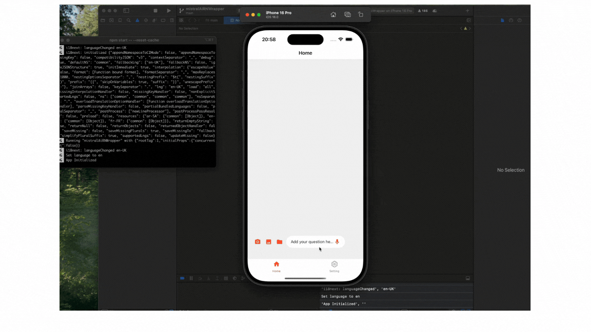

# Mistral AI Chat App

A React Native application that integrates with Mistral AI, providing a ChatGPT-like experience. The app is built with a scalable architecture, utilizing best practices for clean code and project structure to support a large user base and future enhancements. It leverages modern libraries and tools, ensuring optimal performance and maintainability.

By Malik CHOHRA


## Features

- **Real-time AI Conversations**: Chat with Mistral AI as you would with ChatGPT.
- **Scalable Architecture**: Designed to handle a growing codebase and user base.
- **State Management**: Uses Redux Toolkit for efficient state management and Redux Persist for persisting state.
- **Internationalization (i18n)**: Supports multiple languages with React i18next.
- **Theme Management**: Customizable themes using React Native Paper.
- **Optimized Performance**: Utilizes React Native Fast Image for better image handling and Reanimated for smooth animations.
- **Responsive Design**: Implements React Native Size Matters for adaptive screen sizes.
- **Environment Configuration**: Managed via React Native Config for environment variables.
- **Unit Testing & E2E Testing**: Includes Jest and Detox for comprehensive testing.

## Project Structure

```plaintext
src/
├── api/                         # API-related files
│   ├── Api.ts                   # Main API configuration
│   ├── constant.ts              # API-related constants
│   ├── chatApi/                 # Mistral AI le chat, specific API routes and methods
├── assets/                      # Static assets like images, icons, and fonts
├── components/                  # Reusable UI components
│   ├── LoadingComponent/        # Loading state component
├── container/                   # Providers for app-wide configurations (theme, language)
├── hooks/                       # Custom hooks for various functionalities
├── i18n/                        # Internationalization setup
├── navigation/                  # App navigation configuration
├── redux/                       # Redux state management
│   ├── mistralAIchats/          # Redux slice for Mistral AI chat functionality
├── screens/                     # App screens
│   ├── HomeScreen/              # Main chat interface
│   ├── SettingScreen/           # User settings
├── theme/                       # Theming utilities and configurations
├── types/                       # TypeScript type definitions
└── utils/                       # Utility functions and helpers
```

## Prerequisites

- Node.js
- Yarn 
- React Native CLI or Expo CLI

## Installation

Clone the repository:

```bash
git clone git@github.com:chohra-med/mistralAIRN.git
```

Install dependencies:

```bash
cd mistralAIRN
yarn install
# or npm install
```

Set up environment variables: Configure your `.env` file using the example `.env.example`.

Run the app:

```bash
yarn start
yarn android
yarn ios
```

## Libraries Used

- **React Native**: For building the cross-platform app.
- **React Navigation**: Manages navigation within the app.
- **Redux Toolkit**: For managing the app's state.
- **React Native Paper**: Provides theming and UI components.
- **Jest & Detox**: For unit and end-to-end testing.
- **Fastlane**: Automates the CI/CD process.
- **Axios**: Handles API requests.
- **Luxon**: Facilitates date and time handling.
- **React i18next**: Manages internationalization.
- **React Native Config**: Manages environment variables.
- **React Native Fast Image**: Optimizes image loading.
- **React Native Localize**: Handles localization.
- **React Native Reanimated**: Enables smooth animations.
- **React Native Size Matters**: Ensures responsive design.
- **React Native Splash Screen**: Manages splash screen display.
- **React Native SVG**: Supports SVG icons.
- **React Native Vector Icons**: Manages icons.
- **Redux Persist**: Persists the Redux state.

## Example App

Below is a quick preview of the app in action:



## Contributing

Contributions are welcome! Please follow these steps to contribute:

1. Fork the repository
2. Create a new branch

   ```bash
   git checkout -b feature/your-feature-name
   ```

3. Commit your changes

   ```bash
   git commit -m "Add your commit message"
   ```

4. Push your branch

   ```bash
   git push origin feature/your-feature-name
   ```

5. Create a Pull Request

## License

This project is licensed under the MIT License.

By Malik CHOHRA
Feel free to follow me on [LinkedIn](https://www.linkedin.com/in/malik-chohra/)
